# Network Traffic Analysis & Threat Detection | Wireshark

> End-to-end analysis of a real-world PCAP file to identify C2 communication, extract attacker IOCs, enumerate compromised user accounts, and validate findings using threat intelligence tools

---

## Table of Contents

- [Objective](#objective)
- [Tools & Environment](#tools--environment)
- [PCAP Overview](#pcap-overview)
- [Analysis & Filters Used](#analysis--filters-used)
- [Key Findings](#key-findings)
- [IOCs Extracted](#iocs-extracted)
- [Threat Intelligence Validation](#threat-intelligence-validation)
- [MITRE ATT&CK Mapping](#mitre-attck-mapping)
- [Screenshots](#screenshots)
- [Key Learnings](#key-learnings)
- [Investigation Narrative](#investigation-narrative)

---

## Objective

Analyse a network packet capture (PCAP) file to:
- Identify the infected host and compromised user account
- Detect command-and-control (C2) communication patterns
- Extract network IOCs (IPs, domains, user-agents)
- Validate IOCs against threat intelligence platforms
- Identify authentication protocols in use and rule out NTLM
- Analyse phishing email headers and sending domain infrastructure for spoofing indicators
- Map findings to MITRE ATT&CK framework

---

## Tools & Environment

| Tool | Purpose |
|---|---|
| Wireshark | Primary PCAP analysis and packet inspection |
| VirusTotal | IP and URL reputation validation |
| MxToolbox Email Header Analyzer | Email header analysis and SPF/DKIM/DMARC checks |
| MxToolbox Domain Health | Full sending domain infrastructure analysis |
| TCP Stream Follow | Reconstruct full conversations from raw packets |

**PCAP file:** `2026-02-28-traffic-analysis-exercise.pcap`
**Total packets:** 15,512
**Analysis date:** February 28, 2026
**Environment:** Windows Active Directory domain (`EASYAS123`)

---

## PCAP Overview

| Field | Value |
|---|---|
| Infected host IP | 10.2.28.88 |
| Compromised username | brolf |
| Full name | Becka Rolf |
| Hostname | DESKTOP-TEYQ2NR |
| Domain | EASYAS123 |
| C2 server IP | 45.131.214.85 |
| C2 communication | HTTP POST to `/fakeurl.htm` over port 443 |
| Malware identified | NetSupport Manager RAT |
| Authentication protocol | Kerberos (NTLM absent) |

---

## Analysis & Filters Used

### 1. Isolate Traffic to Suspected External IP

```
ip.addr == 45.131.214.85
```

Filtered all traffic involving external IP `45.131.214.85`. Revealed repeated HTTP POST requests to `/fakeurl.htm` over port 443 between internal host `10.2.28.88` and the external server — a hallmark of C2 beaconing behaviour. The use of HTTP over port 443 (normally reserved for HTTPS) is a red flag — malware uses this to blend into expected HTTPS traffic while avoiding TLS inspection.

---

### 2. ARP Check — Rule Out ARP Spoofing

```
arp && ip.addr == 10.2.28.88
```

Zero results returned. No ARP packets associated with the infected host — confirms no ARP poisoning or spoofing activity present in this capture. Useful negative finding that narrows the attack vector.

---

### 3. Ethernet Layer — Identify MAC Address

```
eth.addr && ip.addr == 10.2.28.88 && ip.addr == 45.131.214.85
```

Identified the MAC address of the infected host: `Intel_b2:4d:ad (00:19:d1:b2:4d:ad)` — an Intel NIC. Useful for asset identification and correlating with DHCP logs or network inventory if available.

---

### 4. Kerberos — Extract Compromised Username

```
ip.addr == 10.2.28.88 && kerberos.CNameString
```

Filtered Kerberos authentication packets. AS-REQ and multiple TGS-REP packets found — normal Active Directory authentication flow. Expanded the `as-req` packet body and extracted:
- **CNameString: `brolf`** — the username of the account authenticating
- **Realm: `EASYAS123`** — the Active Directory domain name
- **Hostname: `DESKTOP-TEYQ2NR`** — the infected machine name

This is how analysts identify which user account was active on a compromised host without access to Windows event logs.

---

### 5. TCP Stream Follow — Reconstruct Kerberos Exchange

```
Right-click packet → Follow → TCP Stream (Stream eq 6)
```

Followed the full TCP stream of the Kerberos exchange. Visible in plaintext: `brolf`, `EASYAS123`, `krbtgt`, `DESKTOP-TEYQ2NR` — confirming the full AD environment context and validating the username extraction from packet 243.

---

### 6. NTLM Check — Confirm Authentication Protocol

```
ntlmssp
```

Zero results. NTLM authentication completely absent from this capture — the environment uses Kerberos exclusively. This is significant: pass-the-hash attacks require NTLM. The absence of NTLM rules out that attack vector for this incident.

---

### 7. SAMR — User Account Enumeration

```
ip.addr == 10.2.28.88  [String search: "Rolf"]
```

SAMR (Security Account Manager Remote) protocol packets revealed active account enumeration against the domain controller (`10.2.28.2`). Packet sequence shows a complete enumeration chain:

`OpenDomain → LookupNames → OpenUser → QueryUserInfo → GetGroupsForUser → GetAliasMembership → Close`

The `QueryUserInfo` response (packet 339, 862 bytes) returned full account details for `brolf`:
- **Account Name:** brolf
- **Full Name:** Becka Rolf
- **Force Password Change:** Apr 11, 2026

This enumeration pattern is consistent with post-compromise reconnaissance — the attacker querying AD for user group membership and account details.

---

### 8. C2 Traffic — NetSupport RAT Identification

```
ip.src == 10.2.28.88 && ip.dst == 45.131.214.85
```

Isolated all outbound traffic from the infected host to the C2 server. Key findings from HTTP layer inspection:
- **Request Method:** POST
- **Request URI:** `/fakeurl.htm`
- **User-Agent:** `NetSupport Manager/1.3`
- **Content-Type:** `application/x-www-form-urlencoded`
- **Port:** 443 (HTTP over HTTPS port — unencrypted, flagged by Wireshark as anomalous)

`NetSupport Manager` is a legitimate remote access tool frequently abused by threat actors as a RAT (Remote Access Trojan). Its user-agent string appearing in repeated POST requests to an external IP is a confirmed malware IOC. Wireshark flagged this with an Expert Info warning: *"Unencrypted HTTP protocol detected over encrypted port."*

---

### 9. VirusTotal — IP Reputation Check

Submitted `45.131.214.85` to VirusTotal for threat intelligence validation.

**Result: 12/95 security vendors flagged as malicious**

Vendors flagging as malicious/malware: ADMINUSLabs, alphaMountain.ai, AlphaSOC, BitDefender, CRDF, CyRadar, Dr.Web, Fortinet, G-Data, Lionic, MalwareURL, SOCRadar
Vendors flagging as suspicious: ESET, Gridinsoft

This confirms `45.131.214.85` as a known malicious IP — the C2 server identification is validated.

---

### 10. MxToolbox — Phishing Email Header Analysis

Analysed email headers using MxToolbox Email Header Analyzer.

**Authentication failures:**
- DMARC: **FAIL**
- SPF Alignment: **FAIL**
- SPF Authenticated: **FAIL**
- DKIM Alignment: **FAIL**
- DKIM Authenticated: **FAIL**

**Relay chain:**

| Hop | From | Time |
|---|---|---|
| 1 | xtbmondo.com (143.92.60.168) | Nov 3, 2022 2:44:27 AM |
| 2 | Microsoft EOP relay | Nov 3, 2022 2:44:29 AM |
| 3 | Office365 internal relay | Nov 3, 2022 2:44:29 AM |
| 4 | Delivered | Nov 3, 2022 2:44:29 AM |

Hop 1 sender `xtbmondo.com` (143.92.60.168) is **blacklisted**. All email authentication mechanisms failed — this is a spoofed/phishing email that bypassed basic filtering.

---

### 11. MxToolbox — Phishing Domain Infrastructure Analysis

Ran a full Domain Health Check on `xtbmondo.com` using MxToolbox to assess the sending domain's legitimacy.

**Result: 13 Problems — 10 Errors, 3 Warnings**

| Category | Result |
|---|---|
| DMARC | No DMARC record found |
| SPF | No SPF record found |
| MX | DNS Record not found |
| Blacklist | Blacklisted by Spamhaus DBL |
| DNS | Primary Name Server not listed at parent |
| HTTP | Unable to connect to remote server |
| Mail Server | 7 errors, 1 warning, 0 passed |
| Web Server | 1 error — unreachable |

This is not a misconfigured legitimate domain — it is a purpose-built phishing domain with zero legitimate email infrastructure. The complete absence of SPF, DMARC, and MX records combined with Spamhaus DBL blacklisting and an unreachable web server confirms `xtbmondo.com` was created solely to send malicious email, with no intent of establishing legitimate infrastructure.

---

## Key Findings

### Finding 1 — NetSupport RAT C2 Beaconing (Critical)
Host `10.2.28.88` (user: `brolf` / Becka Rolf, hostname: `DESKTOP-TEYQ2NR`) was actively communicating with confirmed malicious IP `45.131.214.85` via repeated HTTP POST requests to `/fakeurl.htm` using the `NetSupport Manager/1.3` user-agent. Traffic ran over port 443 unencrypted — a deliberate evasion technique to blend into HTTPS traffic. VirusTotal confirmed the C2 IP as malicious (12/95 vendors).

### Finding 2 — Post-Compromise Account Enumeration (High)
SAMR protocol analysis revealed systematic Active Directory user enumeration originating from the infected host — querying domain group membership, account details, and security information for user `brolf`. This is consistent with MITRE T1087 (Account Discovery) performed after initial access was established.

### Finding 3 — Phishing Domain Confirmed Malicious Infrastructure (High)
Domain health analysis of `xtbmondo.com` via MxToolbox revealed complete absence of legitimate email infrastructure — no DMARC record, no SPF record, no MX DNS record, and active blacklisting by Spamhaus DBL (one of the most trusted spam/malware domain blacklists globally). The domain was also unreachable (unable to connect to remote server), confirming it is a throwaway phishing domain with no legitimate purpose. Combined with email header analysis showing all authentication checks failing and the sending IP (143.92.60.168) blacklisted at Hop 1, this conclusively identifies the phishing email as the initial access vector for the NetSupport RAT infection.

### Finding 4 — Kerberos-Only Environment, NTLM Absent (Informational)
No NTLM packets present in the capture. The environment uses Kerberos exclusively for authentication. This rules out pass-the-hash as an attack technique but confirms the attacker used legitimate Kerberos tickets issued to the compromised `brolf` account to move within the environment.

### Finding 5 — No ARP Anomalies (Informational)
No ARP traffic associated with the infected host — rules out ARP poisoning/MITM as a component of this attack. Clean negative finding that narrows the attack timeline and method.

---

## IOCs Extracted

| Type | Value | Confidence |
|---|---|---|
| Malicious IP | 45.131.214.85 | Confirmed — 12/95 VirusTotal detections |
| C2 URI | /fakeurl.htm | High — repeated POST target |
| Malware user-agent | NetSupport Manager/1.3 | Confirmed — known RAT signature |
| Compromised account | brolf / Becka Rolf | Confirmed — extracted from Kerberos |
| Infected hostname | DESKTOP-TEYQ2NR | Confirmed — Kerberos stream |
| Infected host IP | 10.2.28.88 | Confirmed — all C2 traffic source |
| Phishing sender domain | xtbmondo.com | Confirmed — Spamhaus DBL blacklisted, no SPF/DMARC/MX |
| Phishing sender IP | 143.92.60.168 | Confirmed — blacklisted at Hop 1 |
| AD domain | EASYAS123 | Confirmed — Kerberos realm |

---

## Threat Intelligence Validation

| IOC | Platform | Result |
|---|---|---|
| 45.131.214.85 | VirusTotal | 12/95 malicious — BitDefender, Fortinet, ESET, Dr.Web |
| http://45.131.214.85/ | VirusTotal | Malicious — malware category |
| xtbmondo.com (143.92.60.168) | MxToolbox Email Header | Blacklisted at Hop 1 — all email auth failed |
| xtbmondo.com | MxToolbox Domain Health | Blacklisted by Spamhaus DBL — no SPF, DMARC, or MX records, domain unreachable |
| /fakeurl.htm | Context | Known NetSupport RAT C2 endpoint pattern |
| NetSupport Manager/1.3 | Context | Legitimate tool abused as RAT — known TTPs |

---

## MITRE ATT&CK Mapping

| Finding | Tactic | Technique ID | Technique Name |
|---|---|---|---|
| Phishing email delivery | Initial Access | T1566.001 | Spearphishing Attachment |
| NetSupport RAT execution | Execution | T1059 | Command and Scripting Interpreter |
| NetSupport RAT C2 | Command & Control | T1219 | Remote Access Software |
| HTTP over port 443 | Command & Control | T1571 | Non-Standard Port |
| POST beaconing to fakeurl.htm | Command & Control | T1071.001 | Web Protocols |
| SAMR account enumeration | Discovery | T1087.002 | Domain Account Discovery |
| Kerberos ticket usage | Lateral Movement | T1550.003 | Pass the Ticket |
| SPF/DKIM/DMARC bypass | Defense Evasion | T1036 | Masquerading |

---

## Screenshots

### 1. C2 Traffic Identified — External IP Filter
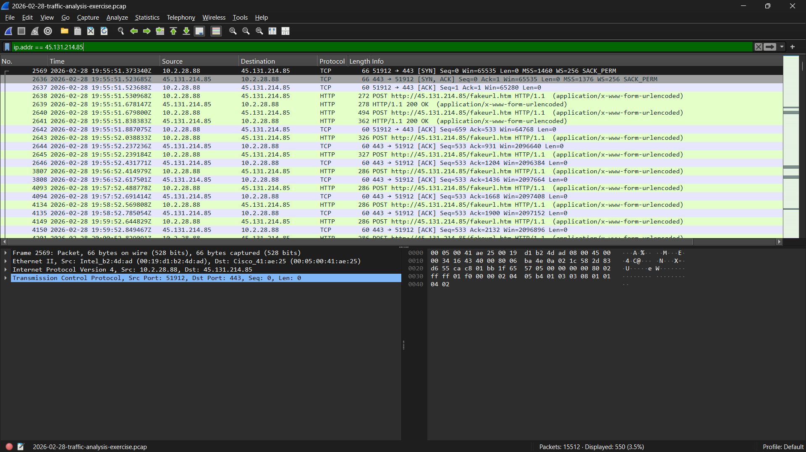
*Filter `ip.addr == 45.131.214.85` reveals HTTP POST requests to `/fakeurl.htm` — C2 beaconing pattern between infected host and malicious server*

---

### 2. ARP Check — No Spoofing Detected
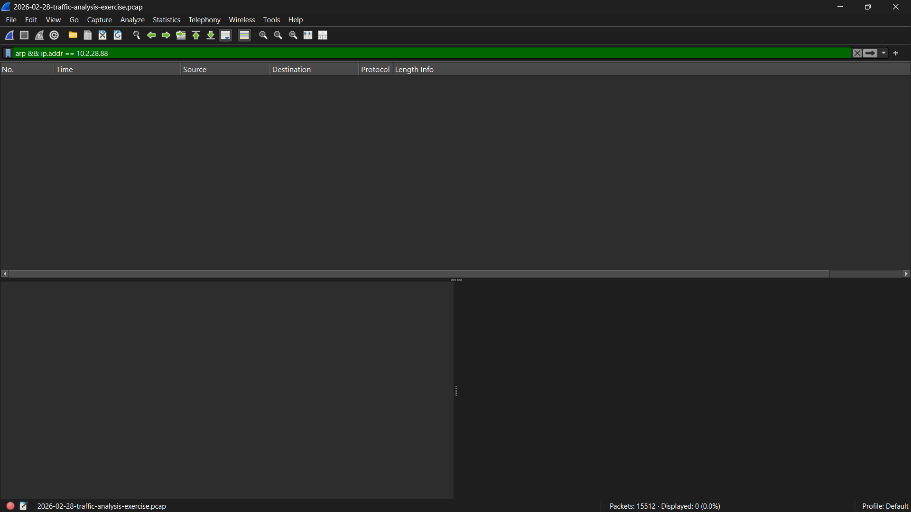
*Filter `arp && ip.addr == 10.2.28.88` returns zero results — ARP poisoning ruled out as attack component*

---

### 3. MAC Address Identification — Ethernet Layer
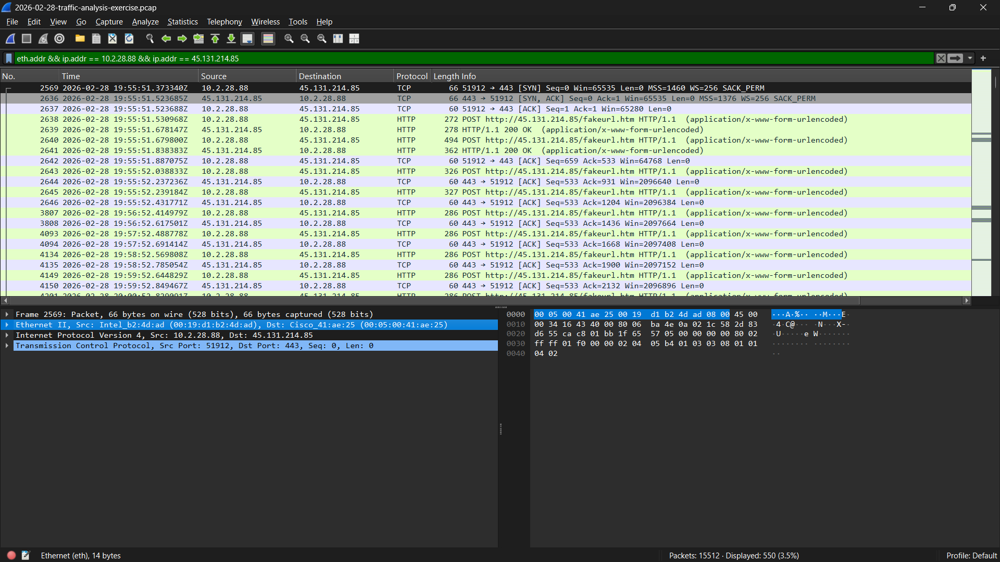
*Combined filter confirms infected host MAC address `Intel_b2:4d:ad` — useful for correlating with network inventory and DHCP logs*

---

### 4. Kerberos Authentication — Username Extraction
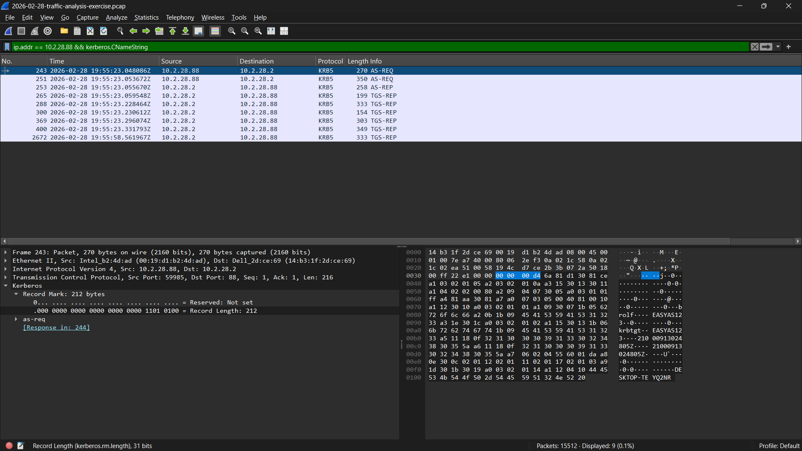
*Filter `ip.addr == 10.2.28.88 && kerberos.CNameString` — AS-REQ and TGS-REP packets, username `brolf` and domain `EASYAS123` extracted from Kerberos packet body*

---

### 5. TCP Stream Follow — Kerberos Exchange Reconstructed
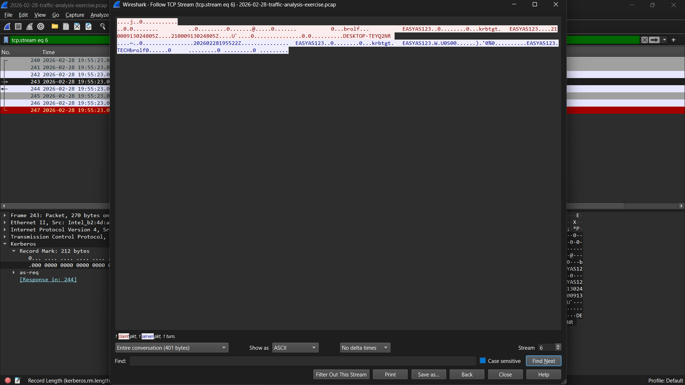
*Full TCP stream of Kerberos exchange reveals `brolf`, `EASYAS123`, `krbtgt`, `DESKTOP-TEYQ2NR` in plaintext — confirms compromised account and domain context*

---

### 6. Kerberos AS-REQ Packet Detail
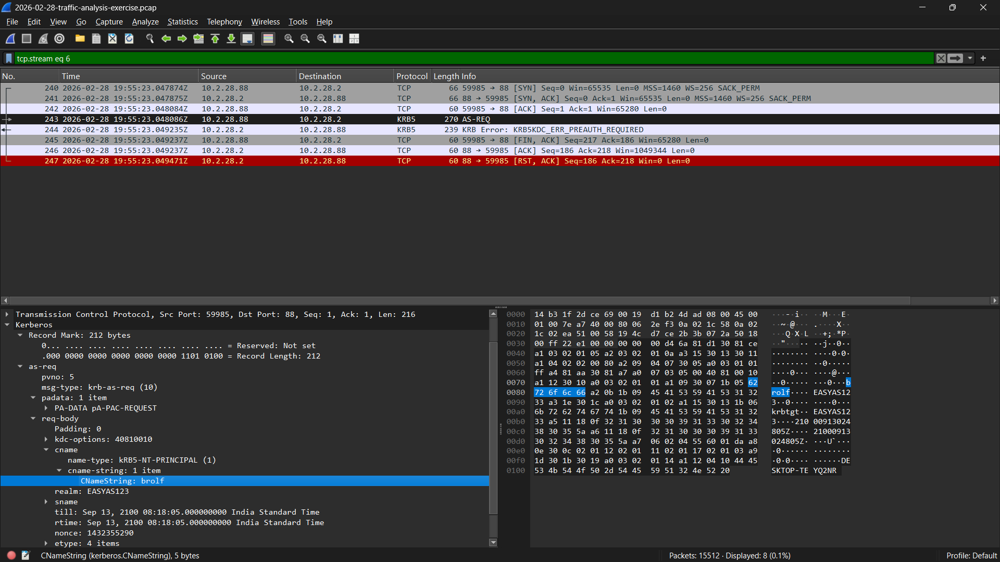
*Expanded Kerberos AS-REQ showing `CNameString: brolf`, realm `EASYAS123`, `KRB5KDC_ERR_PREAUTH_REQUIRED` error — standard pre-auth challenge in AD environments*

---

### 7. Kerberos CNameString — Username Confirmed
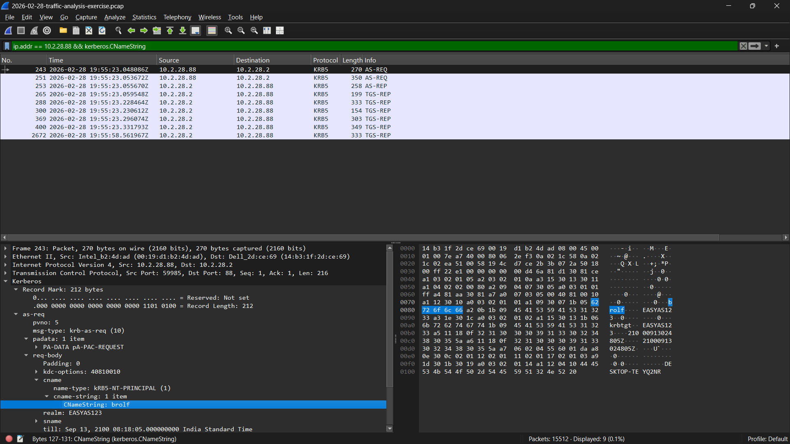
*`CNameString: brolf` highlighted in packet bytes — demonstrates extracting username directly from protocol field without Windows event logs*

---

### 8. NTLM Check — Protocol Absent
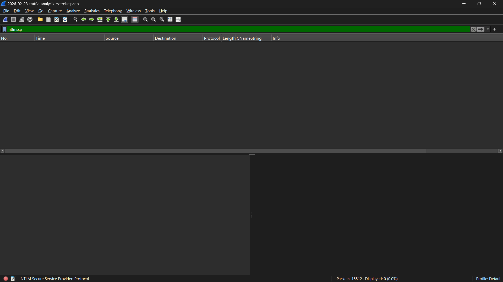
*Filter `ntlmssp` returns zero results — NTLM authentication completely absent, environment uses Kerberos exclusively, pass-the-hash ruled out*

---

### 9. SAMR Enumeration — Account Discovery
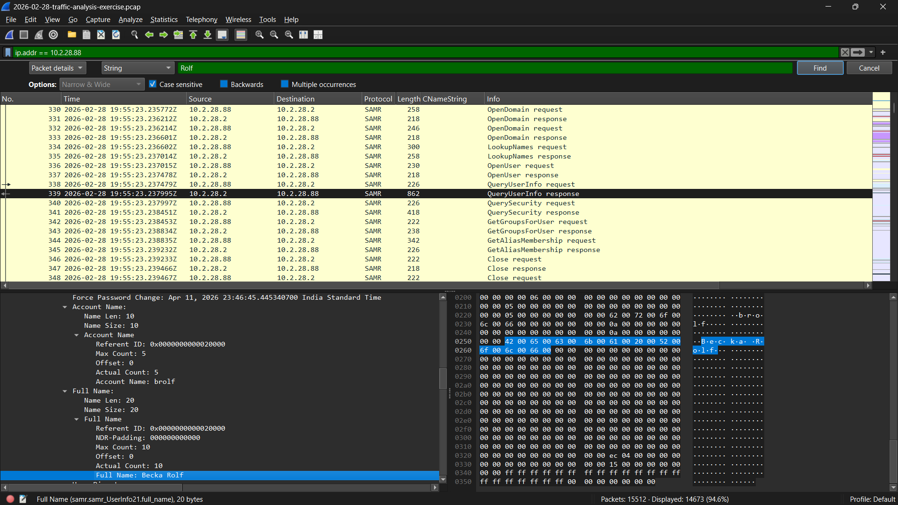
*SAMR protocol showing full enumeration sequence: OpenDomain → LookupNames → QueryUserInfo → GetGroupsForUser. Full name `Becka Rolf` extracted from QueryUserInfo response — post-compromise AD reconnaissance*

---

### 10. NetSupport RAT — C2 Traffic Detail
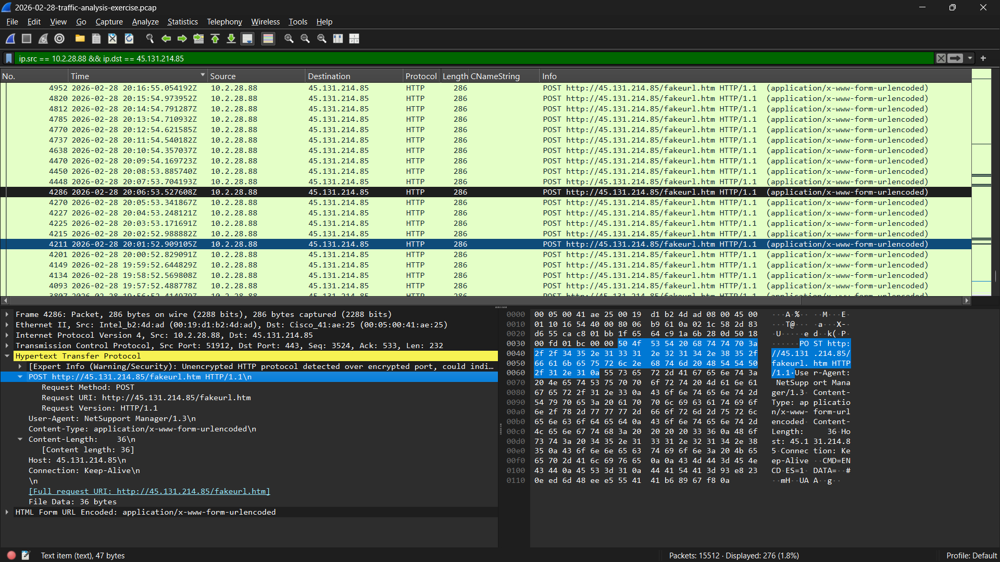
*Outbound traffic `ip.src == 10.2.28.88 && ip.dst == 45.131.214.85` — repeated HTTP POST to `/fakeurl.htm`, User-Agent `NetSupport Manager/1.3` confirms RAT identification*

---

### 11. NetSupport RAT — HTTP Layer Inspection
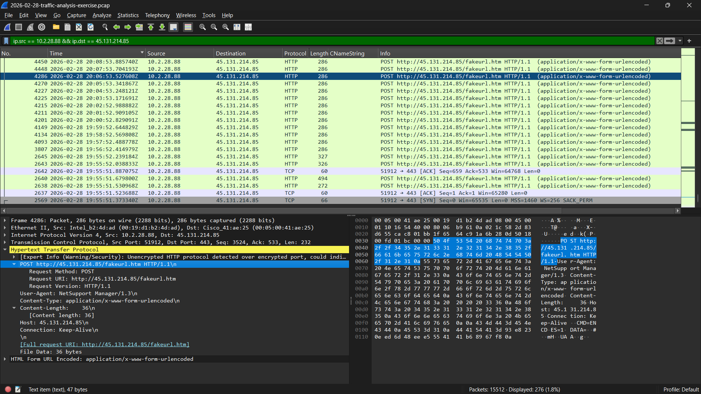
*HTTP layer expanded — POST method, `/fakeurl.htm` URI, `NetSupport Manager/1.3` user-agent, `application/x-www-form-urlencoded` content type. Wireshark Expert Info warning: unencrypted HTTP over port 443*

---

### 12. VirusTotal — C2 IP Confirmed Malicious
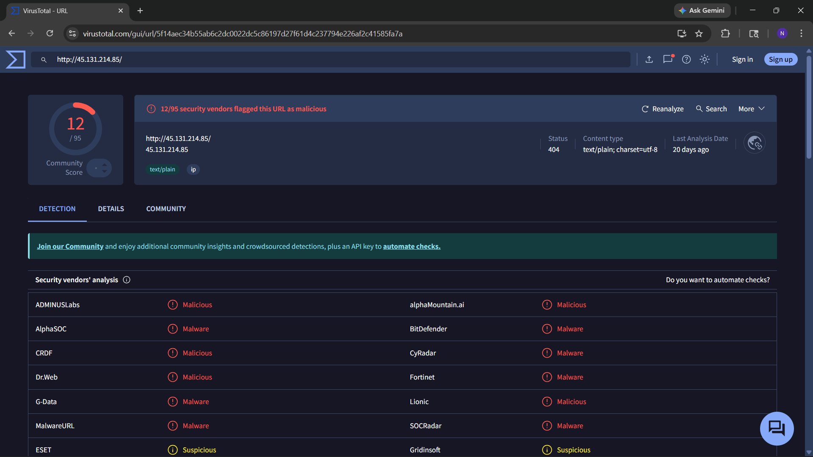
*`45.131.214.85` flagged malicious by 12/95 vendors including BitDefender, Fortinet, Dr.Web, ESET — threat intelligence confirms C2 server identification*

---

### 13. MxToolbox — Phishing Email Header Analysis
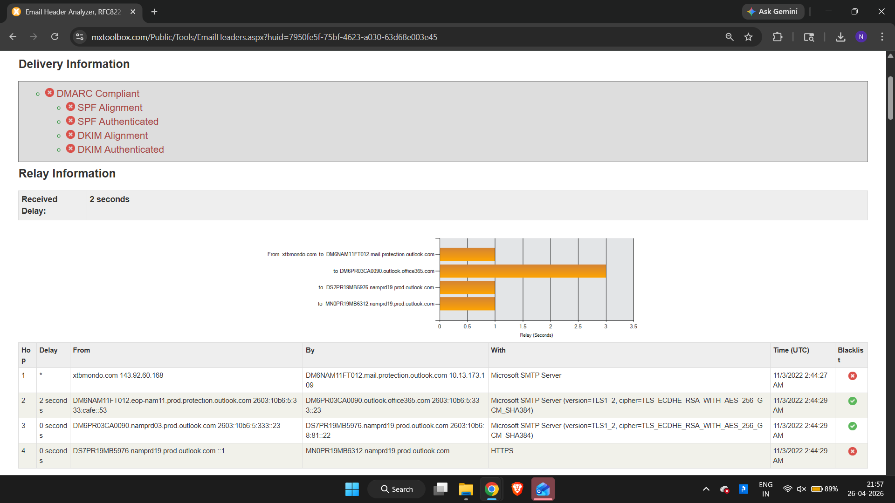
*All email authentication checks failed — DMARC, SPF, DKIM all red. Sending domain `xtbmondo.com` (143.92.60.168) blacklisted at Hop 1 — confirmed phishing email*

---

### 14. MxToolbox — Phishing Domain Health Check
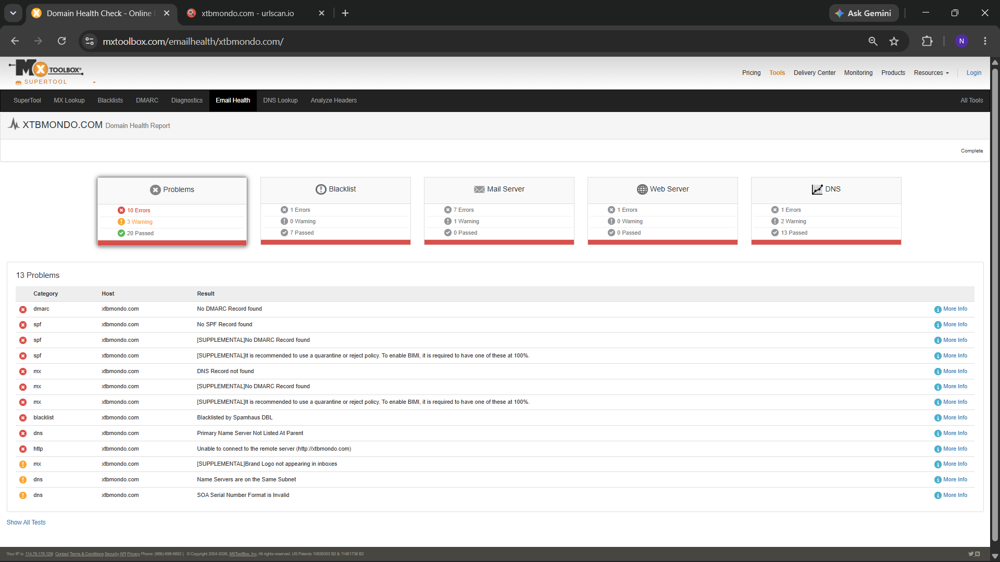
*Domain health report for `xtbmondo.com` — 10 errors including no DMARC, no SPF, no MX record, blacklisted by Spamhaus DBL, domain unreachable. Confirms purpose-built phishing domain with zero legitimate infrastructure*

---

## Key Learnings

**1. Kerberos CNameString is the fastest way to identify a compromised user**
Without access to Windows Event Logs, Kerberos packets in a PCAP reveal the username (`CNameString`), domain (`realm`), and hostname — all from a single filter. This is a critical technique for network-level forensics.

**2. HTTP over port 443 is a high-confidence C2 indicator**
Legitimate HTTPS traffic is TLS-encrypted and not readable in Wireshark. When HTTP (cleartext) appears on port 443, it means malware is deliberately using an unexpected port to evade firewall rules that block standard HTTP (port 80). Wireshark flags this with an Expert Info warning — always investigate these.

**3. NetSupport Manager is a dual-use RAT**
NetSupport Manager is a legitimate IT remote support tool — its presence in logs isn't inherently malicious. What makes it an IOC here is the user-agent appearing in repeated automated POST requests to an external IP at `/fakeurl.htm` with no corresponding user interaction. Context determines whether a tool is legitimate or malicious.

**4. SAMR enumeration reveals post-compromise intent**
The full SAMR sequence (OpenDomain → LookupNames → QueryUserInfo → GetGroupsForUser) is not normal user behaviour — it's programmatic AD enumeration. Seeing this originate from a workstation rather than a domain controller is a strong signal of post-compromise reconnaissance.

**5. Absence of NTLM is itself a finding**
Checking for `ntlmssp` and getting zero results is not a dead end — it's a meaningful negative finding that rules out pass-the-hash and confirms the authentication protocol, which shapes the escalation and remediation path.

**6. Domain health checks go deeper than email headers alone**
Checking email headers reveals how an email was authenticated in transit. Checking the sending domain's full infrastructure (MX records, SPF, DMARC, blacklist status, web server reachability) reveals whether the domain has any legitimate purpose at all. A domain with no MX, no SPF, no DMARC, Spamhaus-blacklisted, and an unreachable web server is a throwaway phishing domain — not a misconfigured legitimate one. This distinction matters for threat intelligence reporting.

**7. Threat intel validation closes the investigation loop**
Extracting an IP from a PCAP and finding it suspicious in Wireshark is preliminary. Submitting it to VirusTotal and seeing 12/95 malicious detections from named vendors (BitDefender, Fortinet, ESET) converts a suspicious observation into a confirmed IOC — this is the step that turns analysis into actionable intelligence.

**8. Failed email authentication is a phishing signature**
DMARC, SPF, and DKIM all failing simultaneously on an email from a blacklisted domain is a near-certain phishing indicator. Legitimate organisations sending emails will pass at least SPF or DKIM. Triple failure + blacklisted sending IP = escalate immediately.

**9. Following TCP streams reveals what filters alone cannot**
The `Follow TCP Stream` feature reconstructed the full Kerberos conversation and surfaced `brolf`, `EASYAS123`, and `DESKTOP-TEYQ2NR` in one view — context that individual packet filters showed only partially. Always follow streams when investigating authentication or C2 traffic.

---

## Investigation Narrative

The analysis began with the PCAP file `2026-02-28-traffic-analysis-exercise.pcap` containing 15,512 packets. Initial investigation focused on identifying the infected host and any suspicious external communication.

Filtering for traffic involving external IP `45.131.214.85` immediately surfaced repeated HTTP POST requests to `/fakeurl.htm` from internal host `10.2.28.88` — a beaconing pattern consistent with malware C2 communication. The use of HTTP over port 443 was flagged by Wireshark as anomalous and confirmed this was not legitimate HTTPS traffic.

Expanding the HTTP layer revealed the user-agent `NetSupport Manager/1.3` — a legitimate remote access tool known to be abused as a RAT by threat actors. VirusTotal submission of `45.131.214.85` confirmed 12/95 security vendors flagged the IP as malicious, validating the C2 identification.

To identify the compromised user, Kerberos filtering (`kerberos.CNameString`) on the infected host's IP extracted username `brolf`, domain `EASYAS123`, and hostname `DESKTOP-TEYQ2NR` from AS-REQ packets. Following TCP stream 6 confirmed these details in the reconstructed conversation. NTLM was checked and found absent — confirming a Kerberos-only environment and ruling out pass-the-hash.

SAMR protocol analysis revealed post-compromise Active Directory enumeration originating from `10.2.28.88` — querying user account details, group membership, and security information for `brolf`. The `QueryUserInfo` response confirmed the full name as Becka Rolf, consistent with the Kerberos username.

Email header analysis via MxToolbox for the suspected phishing delivery email showed complete failure of all authentication mechanisms (DMARC, SPF, DKIM) with the sending domain `xtbmondo.com` blacklisted at Hop 1. A full domain health check on `xtbmondo.com` further confirmed the domain had no legitimate email infrastructure whatsoever — no SPF record, no DMARC record, no MX DNS record, actively blacklisted by Spamhaus DBL, and an unreachable web server. This conclusively identifies `xtbmondo.com` as a purpose-built phishing domain used to deliver the NetSupport RAT payload.

**Attack chain reconstructed:**
Phishing email from `xtbmondo.com` → NetSupport RAT delivered and executed on `DESKTOP-TEYQ2NR` → C2 beaconing to `45.131.214.85` via HTTP POST to `/fakeurl.htm` → Post-compromise AD enumeration via SAMR → Account `brolf` / Becka Rolf confirmed compromised

---

## Author

**Nikita Suhane**

*Tools: Wireshark | VirusTotal | MxToolbox | Platform: Local Lab*
*PCAP Source: malware-traffic-analysis.net*
